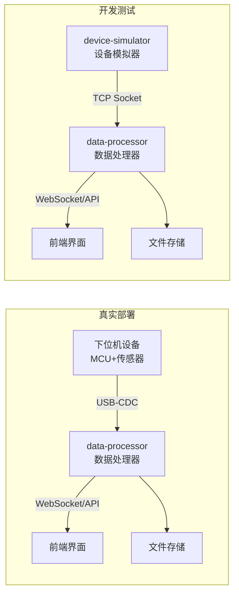
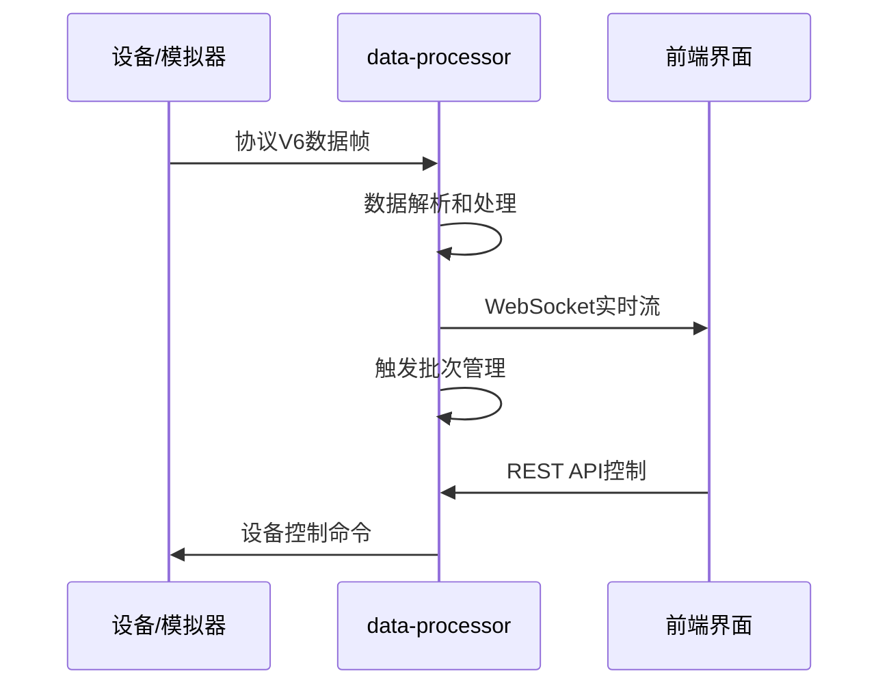

# 通用数据采集系统 - 项目总览

一个实时数据采集和处理系统，支持从开发测试到生产部署的完整流程。

## 系统架构

### 部署模式



### 数据流程



## 项目结构

```
data-acquisition-system/
├── test-sender/           # 设备模拟器，C语言实现
├── data-processor/        # 核心处理器，Rust实现  
├── data-reader/          # 独立采集模块(保留)
├── doc/                  # 协议文档
└── html/                 # 测试界面
```

## 核心功能

### 数据采集
- **协议V6**: 二进制帧格式，CRC16校验
- **双连接方式**: USB-CDC串口(生产) + TCP Socket(开发)
- **触发模式**: 事件驱动的数据采集
- **连续模式**: 实时数据流

### 触发批次管理
- **智能缓存**: 自动管理最近10个触发事件
- **数据预览**: WebSocket实时推送完成的批次
- **自定义保存**: 用户选择文件名、路径、格式
- **质量评估**: 自动分析数据完整性和信号质量

### Web接口
- **REST API**: 设备控制、文件管理、批次操作
- **WebSocket**: 实时数据流和事件通知
- **测试界面**: 完整的功能测试网页

## 快速开始

### 开发测试

```bash
# 1. 启动设备模拟器
cd test-sender
make run

# 2. 启动数据处理器  
cd data-processor
cargo run --release

# 3. 打开测试界面
# 浏览器访问 html/trigger_test.html
```

### 生产部署

```bash
# 1. 编译MCU固件
cd test-sender
make MODE=mcu flash

# 2. 配置串口连接
export DEVICE_TYPE=serial
export SERIAL_PORT=/dev/ttyUSB0

# 3. 启动处理器
cd data-processor  
cargo run --release
```

## 主要API

### 设备控制
```http
POST /api/control/trigger_mode    # 设置触发模式
POST /api/control/start           # 开始采集
POST /api/control/stop            # 停止采集
GET  /api/control/status          # 系统状态
```

### 触发管理
```http
GET    /api/trigger/list                # 批次列表
GET    /api/trigger/preview/{burst_id}  # 批次预览
POST   /api/trigger/save/{burst_id}     # 保存批次
DELETE /api/trigger/delete/{burst_id}   # 删除批次
```

### 文件操作
```http
GET  /api/files                  # 文件列表
GET  /api/files/{filename}       # 下载文件
POST /api/files/save             # 保存文件
```

## 配置说明

### 环境变量
```bash
# 连接配置
DEVICE_TYPE=socket                # serial/socket
SOCKET_ADDRESS=127.0.0.1:9001    # Socket地址
SERIAL_PORT=COM7                  # 串口

# 服务配置
WEB_PORT=8080                     # HTTP端口
WS_PORT=8081                      # WebSocket端口

# 存储配置  
DATA_DIR=./data                   # 数据目录
TRIGGER_CACHE_SIZE=10             # 批次缓存数量
```

### 构建选项
```bash
# 设备模拟器
make BUILD=release MODE=simulation  # PC版本
make BUILD=release MODE=mcu        # MCU版本

# 数据处理器
cargo build --release              # 优化版本
```

## 典型使用场景

### 振动监测
设备持续监测振动信号，检测到异常时自动触发数据采集，采集前后各100ms的振动数据，用户可预览数据质量后选择保存。

### 冲击测试  
产品跌落测试中，冲击传感器检测到冲击事件时触发采集，自动保存冲击前后的完整加速度数据，支持导出为CSV格式供分析软件使用。

### 信号分析
实时监控多通道信号质量，触发事件发生时采集所有通道数据，自动评估信号完整性，标记异常数据供进一步分析。

## 技术栈

- **设备层**: C语言 + 协议V6 + CRC校验
- **处理层**: Rust + Tokio异步 + Serde序列化  
- **Web层**: Axum框架 + WebSocket + REST API
- **前端**: HTML5 + JavaScript + Chart.js

## 部署注意事项

### 硬件要求
- **开发**: 支持Rust编译的系统，4GB RAM
- **MCU部署**: STM32F4或类似MCU，USB-CDC支持
- **传输**: USB2.0或更高，稳定的电源供应

### 性能指标
- **采样率**: 最高100kHz/通道(MCU模式)
- **延迟**: 端到端<50ms
- **吞吐量**: 1MB/s(仿真模式)
- **并发**: 支持多WebSocket客户端

### 故障排除
- **设备连接**: 检查串口权限和波特率设置
- **内存不足**: 调整TRIGGER_CACHE_SIZE减少缓存
- **数据丢失**: 验证CRC校验和帧完整性
- **WebSocket断开**: 检查防火墙和代理设置