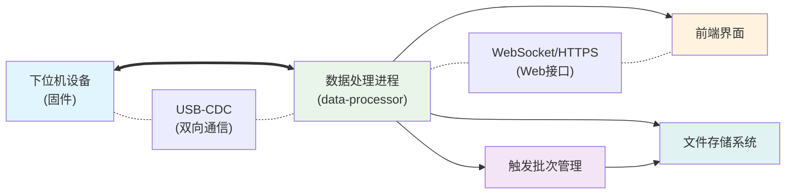
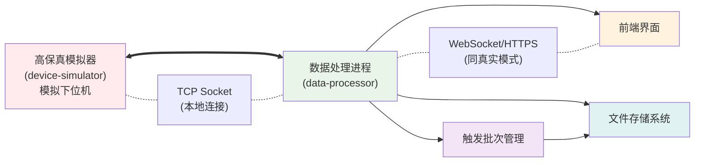
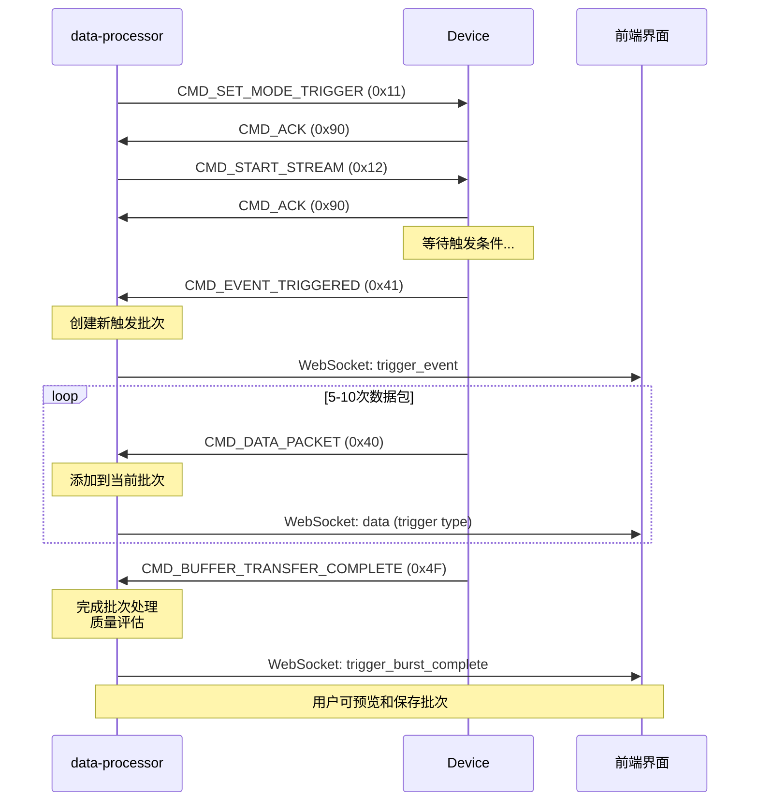
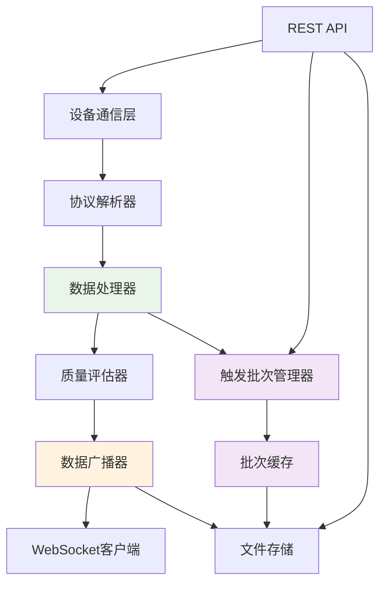
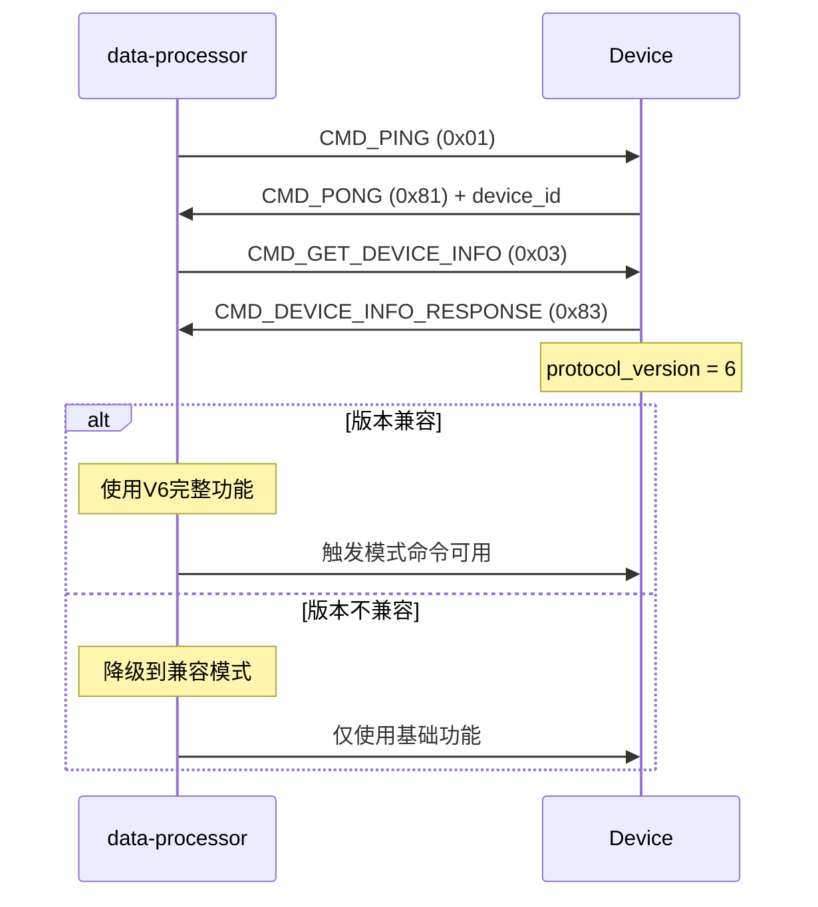

# 通用数据采集系统通信协议规范 V6 (增强版)

## 1. 概述

本规范旨在为一套高性能、可扩展的通用数据采集系统，定义标准化的通信协议。它不局限于任何特定应用，而是提供了一个灵活的框架，能够支持多通道、多速率的复杂采集任务，并特别增强了触发模式下的数据管理能力。

### 1.1 系统架构图

#### **真实模式 (部署时)**



#### **测试模式 (开发/调试时)**



### 1.2 架构增强说明 (v2.0)

**当前架构**在原有基础上新增了关键组件：

- **触发批次管理模块**：智能管理触发事件产生的数据批次
- **增强的文件存储系统**：支持自定义路径和多格式导出
- **实时质量评估**：自动评估数据质量并提供统计信息
- **智能缓存机制**：自动管理内存使用，避免溢出

**新增优势**：
- 用户完全控制触发数据的保存时机和格式
- 实时预览触发数据质量和统计信息
- 支持批量触发事件的高效处理
- 提供完整的数据生命周期管理

### 1.3 通信链路

本规范定义一个关键通信链路和增强的数据管理流程：

- **设备链路 (Device <-> data-processor)**: data-processor与下位机设备之间的直接通信。此协议运行于 USB-CDC (真实模式) 或 TCP Socket (测试模式) 之上，采用二进制帧格式，追求高效和可靠。

- **触发数据管理流程**: 在设备链路基础上，新增了完整的触发批次生命周期管理，从事件检测到数据保存的全过程自动化处理。

## 2. 设备链路协议 (Device <-> data-processor)

### 2.1. 基础帧格式

所有设备链路的通信都基于统一的二进制帧结构。所有多字节字段均采用小端序 (Little-Endian)。

| 字段 | 大小 (字节) | 描述 |
|------|-------------|------|
| **FrameHead** | 2 | 帧头，固定为 0xAA 0x55 |
| **Length** | 2 | 从CommandID到CheckSum的总长度，小端序 |
| **CommandID** | 1 | 命令ID，定义了帧的类型和用途 |
| **Seq** | 1 | 序列号，用于匹配请求和响应 |
| **Payload** | N | 载荷数据，具体结构由CommandID决定 |
| **CheckSum** | 2 | CRC16校验，范围从CommandID到Payload末尾 |
| **FrameTail** | 2 | 帧尾，固定为 0x55 0xAA |

**帧结构可视化**:  
`FrameHead(2B) | Length(2B) | CommandID(1B) | Seq(1B) | Payload(NB) | CheckSum(2B) | FrameTail(2B)`

### 2.2. 校验算法规范

**CRC16 算法**: 采用 CRC-16/MODBUS 标准
- **多项式**: 0xA001 (反向)
- **初始值**: 0xFFFF  
- **校验范围**: 从CommandID到Payload末尾
- **字节序**: 校验和采用小端序存储

```c
uint16_t CRC16_Calc(const uint8_t* data, uint16_t length, uint16_t initVal)
{
    uint16_t crc = initVal; // 0xFFFF
    
    for (uint16_t i = 0; i < length; i++) {
        crc ^= (uint16_t)data[i];
        for (uint8_t j = 0; j < 8; j++) {
            if (crc & 0x0001) {
                crc >>= 1;
                crc ^= 0xA001; // MODBUS 多项式
            } else {
                crc >>= 1;
            }
        }
    }
    return crc;
}
```

### 2.3. CommandID 定义

CommandID 是协议的核心，定义了所有交互类型。

#### **系统控制 (0x00 - 0x0F)**

| ID (Hex) | 方向 | 命令名称 | 描述与核心用途 |
|----------|------|----------|----------------|
| 0x01 | PC -> Dev | CMD_PING | 设备发现核心。data-processor发送此命令探测设备。 |
| 0x81 | Dev -> PC | CMD_PONG | 设备发现核心。设备收到PING后必须回复此命令，并携带自身唯一ID。 |
| 0x02 | PC -> Dev | CMD_GET_STATUS | 请求设备当前状态（如模式、错误码等）。 |
| 0x82 | Dev -> PC | CMD_STATUS_RESPONSE | 回复设备状态。 |
| 0x03 | PC -> Dev | CMD_GET_DEVICE_INFO | 请求获取设备的详细信息（型号、版本等）。 |
| 0x83 | Dev -> PC | CMD_DEVICE_INFO_RESPONSE | 回复设备的详细信息。 |

#### **采集配置与控制 (0x10 - 0x1F)**

| ID (Hex) | 方向 | 命令名称 | 描述与核心用途 |
|----------|------|----------|----------------|
| 0x10 | PC -> Dev | CMD_SET_MODE_CONTINUOUS | 命令设备进入"连续流"模式。 |
| 0x11 | PC -> Dev | CMD_SET_MODE_TRIGGER | 命令设备进入"事件触发"模式。**触发增强模式的关键命令**。 |
| 0x12 | PC -> Dev | CMD_START_STREAM | 在当前模式下，开始数据传输或事件监听。 |
| 0x13 | PC -> Dev | CMD_STOP_STREAM | 在当前模式下，停止数据传输或事件监听。 |
| 0x14 | PC -> Dev | CMD_CONFIGURE_STREAM | 配置数据流的格式，如采样率、通道数等。 |
| 0x90 | Dev -> PC | CMD_ACK | 通用成功应答 (ACK)。 |
| 0x91 | Dev -> PC | CMD_NACK | 通用失败应答 (NACK)，Payload包含错误码。 |

#### **数据与事件传输 (0x40 - 0x4F)**

| ID (Hex) | 方向 | 命令名称 | 描述与核心用途 |
|----------|------|----------|----------------|
| 0x40 | Dev -> PC | CMD_DATA_PACKET | 核心数据包。以此帧格式发送采样数据。**触发模式下承载批次数据**。 |
| 0x41 | Dev -> PC | CMD_EVENT_TRIGGERED | 触发模式核心。当设备在内部检测到事件时，发送此帧通知PC。**触发批次开始的标志**。 |
| 0x42 | PC -> Dev | CMD_REQUEST_BUFFERED_DATA | 触发模式核心。data-processor收到EVENT_TRIGGERED后，发送此命令请求设备上传其内部缓存的事件数据。 |
| 0x4F | Dev -> PC | CMD_BUFFER_TRANSFER_COMPLETE | 在触发数据上传完毕后，设备发送此帧作为结束信号。**触发批次完成的标志**。 |

#### **日志 (0xE0 - 0xEF)**

| ID (Hex) | 方向 | 命令名称 | 描述与核心用途 |
|----------|------|----------|----------------|
| 0xE0 | Dev -> PC | CMD_LOG_MESSAGE | 设备主动上报日志信息，用于调试。 |

### 2.4. 错误处理机制

#### **CMD_NACK (0x91) 错误码定义**

Payload结构 (共2字节):
| 偏移 | 大小 | 类型 | 字段名 | 描述 |
|------|------|------|--------|------|
| 0 | 1 | uint8_t | error_code | 错误类别码 |
| 1 | 1 | uint8_t | sub_error | 子错误码 |

**错误码分类**:
| error_code | 含义 | sub_error示例 |
|------------|------|---------------|
| 0x01 | 参数错误 | 0x01:采样率不支持, 0x02:通道ID无效 |
| 0x02 | 状态错误 | 0x01:设备未初始化, 0x02:正在采集中, 0x03:触发未发生 |
| 0x03 | 硬件错误 | 0x01:ADC故障, 0x02:存储器错误, 0x03:触发器故障 |
| 0x04 | 资源不足 | 0x01:缓冲区满, 0x02:内存不足, 0x03:触发缓冲区满 |
| 0x05 | 命令不支持 | 0x01:当前模式不支持, 0x02:固件版本不支持 |

#### **超时处理策略**

- **命令响应超时**: data-processor发送命令后，如1秒内未收到ACK/NACK，可重发最多3次
- **数据流超时**: 连续流模式下，如5秒内未收到数据包，触发连接检查
- **触发超时**: 触发模式下，如30秒内未收到触发事件，记录告警但继续等待
- **心跳机制**: 建议每30秒发送一次CMD_PING保持连接活跃

## 3. 详细命令载荷规范

本章节详细定义了每个CommandID的Payload结构。所有多字节字段均为小端序。

### **CMD_PING (0x01) & CMD_PONG (0x81)**

**请求** (PC -> Dev): Payload 为空 (0字节)。

**响应** (Dev -> PC): Payload 结构 (共8字节)
| 偏移 | 大小 | 类型 | 字段名 | 描述 |
|------|------|------|--------|------|
| 0 | 8 | uint64_t | device_unique_id | 设备的唯一标识符 (如MCU的唯一ID、序列号等) |

### **CMD_GET_DEVICE_INFO (0x03) & CMD_DEVICE_INFO_RESPONSE (0x83)**

**请求** (PC -> Dev): Payload 为空 (0字节)。

**响应** (Dev -> PC): Payload 为变长结构
| 偏移 | 大小 | 类型 | 字段名 | 描述 |
|------|------|------|--------|------|
| 0 | 1 | uint8_t | protocol_version | 本设备支持的协议版本号 (例如: 6) |
| 1 | 2 | uint16_t | firmware_version | 固件版本号 (例如: 0x0102 表示 v1.2) |
| 3 | 1 | uint8_t | num_physical_channels | 设备物理通道的总数 (N) |
| 4 | ... | ChannelCaps[] | channel_capabilities | N个通道能力描述块，依次排列 |

**ChannelCaps 结构体** (变长):
| 偏移 | 大小 | 类型 | 字段名 | 描述 |
|------|------|------|--------|------|
| 0 | 1 | uint8_t | channel_id | 通道ID (0 to N-1) |
| 1 | 4 | uint32_t | max_sample_rate_hz | 该通道支持的最大采样率 |
| 5 | 2 | uint16_t | supported_formats_mask | bitmask, 0x01:int16, 0x02:int32, 0x04:float32 |
| 7 | 1 | uint8_t | channel_name_len | 通道名称字符串长度 (L_name) |
| 8 | L_name | char[] | channel_name | 通道名称 (如 "Voltage", "Vibration_X") |

### **CMD_CONFIGURE_STREAM (0x14)**

**请求** (PC -> Dev): Payload 为变长结构
| 偏移 | 大小 | 类型 | 字段名 | 描述 |
|------|------|------|--------|------|
| 0 | 1 | uint8_t | num_configs | 本次配置的通道数量 (M) |
| 1 | ... | ChannelConfig[] | channel_configs | M个通道配置块，依次排列 |

**ChannelConfig 结构体** (固定6字节):
| 偏移 | 大小 | 类型 | 字段名 | 描述 |
|------|------|------|--------|------|
| 0 | 1 | uint8_t | channel_id | 要配置的通道ID |
| 1 | 4 | uint32_t | sample_rate_hz | 为该通道设定的采样率 (0表示禁用) |
| 5 | 1 | uint8_t | sample_format | 为该通道设定的格式 (0x01:int16, 0x02:int32, 0x04:float32) |

**响应**: CMD_ACK (0x90) 或 CMD_NACK (0x91)。

### **CMD_DATA_PACKET (0x40)** - 核心数据传输

**数据** (Dev -> PC): Payload 结构 (共 8+N 字节)
| 偏移 | 大小 | 类型 | 字段名 | 描述 |
|------|------|------|--------|------|
| 0 | 4 | uint32_t | timestamp_ms | 本包第一个采样点的时间戳 (ms) |
| 4 | 2 | uint16_t | channel_mask | 核心字段: bitmask, 指示本包包含哪些通道的数据 |
| 6 | 2 | uint16_t | sample_count | 本包包含的每个通道的采样点数量 |
| 8 | N | (varies) | sensor_data | 非交错 (Planar) 的原始采样数据 |

**sensor_data 布局说明**:
数据采用非交错 (Planar / Blocked) 的方式排列。channel_mask中置位的比特位，决定了sensor_data中包含哪些通道的数据块，顺序从低位到高位。

**数据发送策略**:
- **连续模式**: 下位机按固定时间间隔批量发送 (如10ms发送100个采样点)
- **触发模式**: 在收到CMD_EVENT_TRIGGERED后，连续发送5-10个数据包作为一个批次
- **时机控制**: 发送时机完全由下位机固件决定，data-processor被动接收和处理

**示例**:
假设配置了3个通道:
- 通道0: 10kHz, int16
- 通道1: 10kHz, int16  
- 通道2: 1Hz, int16

触发模式数据包序列:
1. **触发数据包1**:
   - channel_mask = 0x0003 (通道0和1)
   - sample_count = 100 (每通道100个样本)
   - sensor_data: [Ch0_s0..s99 (200B), Ch1_s0..s99 (200B)]

2. **触发数据包2-N**: 相同格式，连续时间戳

3. **批次结束**: 收到CMD_BUFFER_TRANSFER_COMPLETE

### **CMD_EVENT_TRIGGERED (0x41)** - 触发事件通知

**数据** (Dev -> PC): Payload 结构 (共14字节)
| 偏移 | 大小 | 类型 | 字段名 | 描述 |
|------|------|------|--------|------|
| 0 | 4 | uint32_t | trigger_timestamp | 触发事件发生的时间戳 (ms) |
| 4 | 2 | uint16_t | trigger_channel | 产生触发的通道ID |
| 6 | 4 | uint32_t | pre_trigger_samples | 预触发采样点数 |
| 10 | 4 | uint32_t | post_trigger_samples | 后触发采样点数 |

**处理流程**:
1. 设备检测到触发事件
2. 发送CMD_EVENT_TRIGGERED通知data-processor
3. data-processor创建新的触发批次
4. 设备开始发送触发数据包(CMD_DATA_PACKET)
5. 数据发送完毕后发送CMD_BUFFER_TRANSFER_COMPLETE

### **CMD_BUFFER_TRANSFER_COMPLETE (0x4F)** - 传输完成

**数据** (Dev -> PC): Payload 为空 (0字节)

**作用**:
- 标识一个完整触发批次的数据传输结束
- 触发data-processor完成批次处理和质量评估
- 使批次数据可供用户预览和保存

### **CMD_LOG_MESSAGE (0xE0)**

**数据** (Dev -> PC): Payload 为变长结构
| 偏移 | 大小 | 类型 | 字段名 | 描述 |
|------|------|------|--------|------|
| 0 | 1 | uint8_t | log_level | 日志级别 (0:DEBUG, 1:INFO, 2:WARN, 3:ERROR) |
| 1 | 1 | uint8_t | msg_len | 日志消息长度 |
| 2 | msg_len | char[] | message | 日志消息内容 (UTF-8编码) |

## 4. 触发模式增强协议流程

### 4.1. 触发事件生命周期



### 4.2. 批次数据结构

data-processor内部维护的触发批次结构：

```rust
pub struct TriggerBurst {
    pub burst_id: String,           // 唯一标识符
    pub trigger_timestamp: u32,     // 触发时间戳
    pub trigger_channel: u16,       // 触发通道
    pub pre_samples: u32,          // 预触发采样数
    pub post_samples: u32,         // 后触发采样数
    pub data_packets: Vec<ProcessedData>, // 所有数据包
    pub is_complete: bool,         // 是否传输完成
    pub total_samples: usize,      // 总采样点数
    pub created_at: i64,          // 创建时间戳
    pub quality_summary: DataQualitySummary, // 质量评估
}
```

### 4.3. 数据质量评估

每个完成的触发批次会自动进行质量评估：

- **电压范围检查**: 确保在0-3.3V范围内
- **饱和度检测**: 检查是否接近ADC量程边界
- **信号平坦度**: 检测异常平坦的信号
- **数据完整性**: 验证数据包序列和长度
- **统计分析**: 计算每通道的min/max/avg/RMS值

## 5. 数据处理进程增强架构

### 5.1. data-processor 增强模块

```
data-processor (v2.0)
├── device_communication.rs    # 设备通信管理 (增强触发处理)
├── data_processing.rs         # 实时处理 + 触发批次管理 (新增)
├── web_server.rs             # REST API + 触发管理接口 (新增)
├── websocket.rs              # WebSocket + 批次事件广播 (新增)
├── file_manager.rs           # 文件存储和管理 (无变化)
└── config.rs                 # 统一配置管理 (无变化)
```

### 5.2. 内部数据流 (增强版)



### 5.3. 事件处理增强

data-processor新增的事件类型：

- **TriggerEvent**: 触发事件开始
- **DataPacket**: 带有触发标识的数据包  
- **BufferTransferComplete**: 触发批次完成
- **TriggerBurstReady**: 批次可供保存

## 6. Web API 增强接口

### 6.1. 触发管理接口 (新增)

| 端点 | 方法 | 描述 |
|------|------|------|
| `/api/trigger/list` | GET | 获取可用触发批次列表 |
| `/api/trigger/preview/{burst_id}` | GET | 预览指定触发批次 |
| `/api/trigger/save/{burst_id}` | POST | 保存触发批次数据 |
| `/api/trigger/delete/{burst_id}` | DELETE | 删除触发批次缓存 |
| `/api/control/request_trigger_data` | POST | 手动请求触发数据 |

### 6.2. 增强的系统状态

状态接口现在包含触发相关信息：

```json
{
  "trigger_status": {
    "cached_bursts": 3,
    "current_burst_active": false,
    "last_trigger_timestamp": 1704067200,
    "total_triggers_received": 25
  }
}
```

### 6.3. WebSocket事件增强

新增WebSocket事件类型：

```json
// 触发批次完成事件
{
  "type": "trigger_burst_complete",
  "burst_id": "trigger_1704067200_1704067205000",
  "trigger_timestamp": 1704067200,
  "total_samples": 1500,
  "quality": "Good",
  "can_save": true,
  "preview_samples": [1.23, 1.24, 1.25, ...],
  "voltage_range": [0.1, 3.2]
}
```

## 7. 性能指标与限制 (更新)

### 7.1. 数据吞吐量

- **触发批次处理**: 支持每秒处理多个触发事件
- **批次大小**: 单个触发批次最大支持10万样本点
- **缓存管理**: 同时缓存最多10个触发批次
- **内存使用**: 每个批次约占用1-5MB内存

### 7.2. 触发模式性能

- **触发延迟**: 从事件发生到通知< 1ms
- **批次完成时间**: 数据传输完成后< 10ms内可供预览
- **质量评估**: 每个批次质量评估< 5ms
- **并发支持**: 支持多个WebSocket客户端同时监听

### 7.3. 存储性能

- **多格式导出**: JSON/CSV/Binary格式导出时间< 100ms
- **文件保存**: 支持自定义路径和并发保存
- **清理策略**: 自动管理缓存大小，防止内存溢出

## 8. 安全性与可靠性 (增强)

### 8.1. 数据完整性增强

- **批次完整性**: 通过传输完成信号确保数据完整
- **质量监控**: 实时监控每个批次的数据质量
- **错误恢复**: 支持部分批次损坏时的恢复机制
- **版本兼容**: 协议向下兼容，支持版本协商

### 8.2. 内存安全

- **智能缓存**: 自动限制缓存批次数量
- **内存监控**: 实时监控内存使用情况
- **溢出保护**: 防止大批次导致的内存溢出
- **优雅降级**: 内存不足时优先保证实时数据流

## 9. 部署和运维 (更新)

### 9.1. 配置管理增强

新增触发模式相关配置：

```bash
# 触发批次管理
TRIGGER_CACHE_SIZE=10        # 缓存批次数量
TRIGGER_TIMEOUT_MS=30000     # 触发超时时间
BURST_MAX_SAMPLES=100000     # 单批次最大样本数
QUALITY_ASSESSMENT=true      # 启用质量评估

# 文件导出设置
EXPORT_FORMATS=json,csv,binary  # 支持的导出格式
MAX_EXPORT_SIZE_MB=100         # 单文件最大导出大小
AUTO_CLEANUP_BURSTS=true       # 自动清理旧批次
```

### 9.2. 监控指标增强

data-processor现在提供完整的触发模式监控：

- **触发事件频率**: 每分钟触发次数
- **批次处理时间**: 从事件到完成的延迟
- **数据质量分布**: Good/Warning/Error批次比例
- **缓存使用情况**: 当前缓存批次数和内存占用
- **导出统计**: 各格式文件导出次数和大小

### 9.3. 故障诊断增强

针对触发模式的专项诊断：

```bash
# 检查触发状态
curl http://127.0.0.1:8080/api/control/status | jq '.data.trigger_status'

# 验证批次缓存
curl http://127.0.0.1:8080/api/trigger/list

# 测试质量评估
curl http://127.0.0.1:8080/api/trigger/preview/{burst_id} | jq '.data.quality_summary'
```

## 10. 协议版本兼容性 (增强)

### 10.1. V6协议新特性

**向下兼容**：V6协议完全兼容V5及以下版本的基础功能
**新增功能**：
- 触发批次生命周期管理
- 增强的数据质量评估
- 多格式导出支持
- 实时预览能力

### 10.2. 版本协商流程



### 10.3. 特性检测

data-processor通过以下方式检测设备支持的功能：

1. **协议版本检查**: 通过CMD_DEVICE_INFO获取版本
2. **命令支持测试**: 发送新命令，根据ACK/NACK判断支持度
3. **功能降级**: 自动适配到设备支持的最高功能级别

## 11. 实际应用案例

### 11.1. 振动监测应用

**场景**: 工业设备振动异常检测

**配置**:
```json
{
  "channels": [
    {"channel_id": 0, "sample_rate": 25600, "format": 1}, // 振动传感器
    {"channel_id": 1, "sample_rate": 25600, "format": 1}  // 参考传感器
  ],
  "trigger_threshold": 2.0,  // 2V触发阈值
  "pre_trigger_samples": 2560,  // 100ms预触发
  "post_trigger_samples": 5120  // 200ms后触发
}
```

**工作流程**:
1. 设备持续监测振动信号
2. 检测到异常振动时自动触发
3. 采集300ms振动数据（包含前后上下文）
4. 自动质量评估，标记异常特征
5. 操作员预览数据，确认是否为真实异常
6. 保存异常事件数据用于后续分析

### 11.2. 冲击测试应用

**场景**: 产品跌落测试数据采集

**配置**:
```json
{
  "channels": [
    {"channel_id": 0, "sample_rate": 50000, "format": 1}, // 加速度计X轴
    {"channel_id": 1, "sample_rate": 50000, "format": 1}, // 加速度计Y轴  
    {"channel_id": 2, "sample_rate": 50000, "format": 1}  // 加速度计Z轴
  ],
  "trigger_threshold": 1.5,  // 1.5V触发阈值
  "pre_trigger_samples": 1000,  // 20ms预触发
  "post_trigger_samples": 4000  // 80ms后触发
}
```

**数据管理**:
- 每次测试自动生成带时间戳的批次ID
- 自动评估冲击强度和持续时间
- 支持多种导出格式供不同分析工具使用
- 批量保存多次测试数据到分类目录

## 12. 最佳实践建议

### 12.1. 触发参数优化

**采样率设置**:
- 根据信号带宽设置，建议采样率≥2.5倍最高频率
- 避免过高采样率导致数据量过大
- 多通道时考虑总带宽限制

**触发参数**:
- 预触发时间应足以包含事件前的背景信号
- 后触发时间应覆盖完整的事件响应
- 触发阈值设置要平衡敏感度和误触发率

**缓存管理**:
- 根据触发频率调整缓存大小
- 高频应用考虑增加缓存批次数量
- 定期清理不需要的历史批次

### 12.2. 数据质量保证

**质量监控**:
- 定期检查数据质量评估结果
- 关注饱和度和平坦度警告
- 监控电压范围异常

**信号完整性**:
- 确保良好的接地和屏蔽
- 避免电源干扰和串扰
- 定期校准传感器和调理电路

### 12.3. 性能优化

**系统配置**:
- 为数据目录使用高速SSD
- 确保足够的可用内存
- 监控CPU使用率，避免处理瓶颈

**网络优化**:
- WebSocket客户端数量要适中
- 考虑数据压缩以减少传输带宽
- 使用有线连接确保稳定性

## 13. 故障排除指南

### 13.1. 常见触发模式问题

**问题**: 触发事件不产生
- 检查触发阈值设置
- 验证信号幅度是否达到阈值
- 确认设备处于触发模式且已启动流

**问题**: 触发批次数据不完整
- 检查设备内存和缓冲区配置
- 验证数据传输稳定性
- 查看错误日志中的NACK响应

**问题**: 质量评估报警过多
- 检查传感器连接和校准
- 验证信号调理电路工作状态
- 调整质量评估参数阈值

### 13.2. 性能问题诊断

**内存使用过高**:
- 检查缓存批次数量设置
- 减少同时处理的批次大小
- 及时清理不需要的批次缓存

**处理延迟过大**:
- 降低数据包发送频率
- 优化质量评估算法参数
- 检查WebSocket客户端数量

## 14. 协议扩展指导

### 14.1. 添加新命令

扩展协议时的建议：

1. **命令ID分配**: 使用未占用的ID段
2. **向后兼容**: 新命令应对旧版本设备优雅降级
3. **错误处理**: 新增相应的NACK错误码
4. **文档更新**: 同步更新协议文档和示例代码

### 14.2. 自定义载荷格式

设计新载荷时考虑：

- **字节对齐**: 使用标准对齐方式
- **端序一致**: 统一使用小端序
- **可扩展性**: 预留扩展字段
- **版本标识**: 包含版本信息以支持演进

## 15. 更新历史

### V6.0 (2025-01-01) - 触发模式增强版
- **重大更新**: 完整的触发批次生命周期管理
- **新增**: 触发事件自动检测和通知机制
- **新增**: 智能数据质量评估和统计分析
- **新增**: 多格式数据导出支持（JSON/CSV/Binary）
- **新增**: 实时批次预览和用户选择保存
- **新增**: WebSocket事件广播增强
- **改进**: 内存管理和性能优化
- **改进**: 错误处理和诊断能力
- **新增**: 完整的测试网页界面

### V5.0 (2024-11-01) - 基础触发支持
- 基本触发模式支持
- 连续流优化
- 协议稳定性改进

### V4.0 及更早版本
- 基础设备通信功能
- 连续模式数据采集
- 基本错误处理

---

**协议V6总结**: 本版本协议在保持向下兼容的基础上，大幅增强了触发模式的智能化程度，提供了从事件检测到数据保存的完整解决方案，特别适合需要精确控制和高质量数据采集的专业应用场景。新增的批次管理和质量评估功能大大提升了用户体验和数据可靠性。