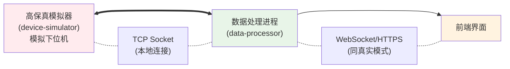
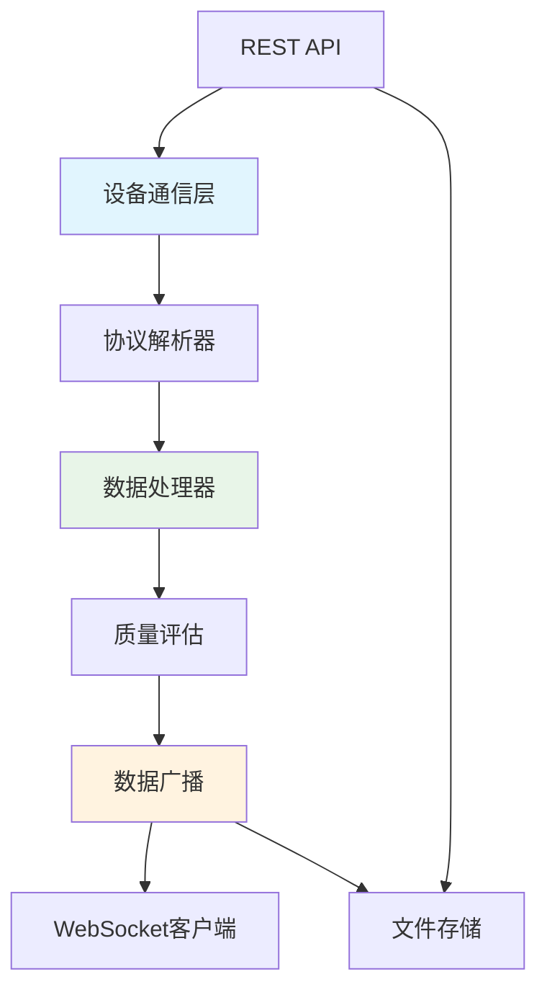

# 通用数据采集系统通信协议规范 V6 (更新版)

## 1. 概述

本规范旨在为一套高性能、可扩展的通用数据采集系统，定义标准化的通信协议。它不局限于任何特定应用，而是提供了一个灵活的框架，能够支持多通道、多速率的复杂采集任务。

### 1.1 系统架构图

#### **真实模式 (部署时)**


#### **测试模式 (开发/调试时)**



### 1.2 架构变更说明

**当前架构**相较于之前版本进行了重大简化：

- **取消了独立的数据采集进程** (data-reader)
- **取消了进程间通信** (IPC) 的复杂性
- **data-processor直接与设备通信**，集成了设备管理、数据采集、实时处理和Web服务

**优势**：
- 降低了系统复杂度
- 减少了进程间通信开销
- 简化了部署和维护
- 提高了数据传输效率
- 统一了错误处理和日志管理

### 1.3 通信链路

本规范现在只定义一个关键通信链路：

- **设备链路 (Device <-> data-processor)**: data-processor与下位机设备之间的直接通信。此协议运行于 USB-CDC (真实模式) 或 TCP Socket (测试模式) 之上，采用二进制帧格式，追求高效和可靠。

## 2. 设备链路协议 (Device <-> data-processor)

### 2.1. 基础帧格式

所有设备链路的通信都基于统一的二进制帧结构。所有多字节字段均采用小端序 (Little-Endian)。

| 字段 | 大小 (字节) | 描述 |
|------|-------------|------|
| **FrameHead** | 2 | 帧头，固定为 0xAA 0x55 |
| **Length** | 2 | 从CommandID到CheckSum的总长度，小端序 |
| **CommandID** | 1 | 命令ID，定义了帧的类型和用途 |
| **Seq** | 1 | 序列号，用于匹配请求和响应 |
| **Payload** | N | 载荷数据，具体结构由CommandID决定 |
| **CheckSum** | 2 | CRC16校验，范围从CommandID到Payload末尾 |
| **FrameTail** | 2 | 帧尾，固定为 0x55 0xAA |

**帧结构可视化**:  
`FrameHead(2B) | Length(2B) | CommandID(1B) | Seq(1B) | Payload(NB) | CheckSum(2B) | FrameTail(2B)`

### 2.2. 校验算法规范

**CRC16 算法**: 采用 CRC-16/MODBUS 标准
- **多项式**: 0xA001 (反向)
- **初始值**: 0xFFFF  
- **校验范围**: 从CommandID到Payload末尾
- **字节序**: 校验和采用小端序存储

```c
uint16_t CRC16_Calc(const uint8_t* data, uint16_t length, uint16_t initVal)
{
    uint16_t crc = initVal; // 0xFFFF
    
    for (uint16_t i = 0; i < length; i++) {
        crc ^= (uint16_t)data[i];
        for (uint8_t j = 0; j < 8; j++) {
            if (crc & 0x0001) {
                crc >>= 1;
                crc ^= 0xA001; // MODBUS 多项式
            } else {
                crc >>= 1;
            }
        }
    }
    return crc;
}
```

### 2.3. CommandID 定义

CommandID 是协议的核心，定义了所有交互类型。

#### **系统控制 (0x00 - 0x0F)**

| ID (Hex) | 方向 | 命令名称 | 描述与核心用途 |
|----------|------|----------|----------------|
| 0x01 | PC -> Dev | CMD_PING | 设备发现核心。data-processor发送此命令探测设备。 |
| 0x81 | Dev -> PC | CMD_PONG | 设备发现核心。设备收到PING后必须回复此命令，并携带自身唯一ID。 |
| 0x02 | PC -> Dev | CMD_GET_STATUS | 请求设备当前状态（如模式、错误码等）。 |
| 0x82 | Dev -> PC | CMD_STATUS_RESPONSE | 回复设备状态。 |
| 0x03 | PC -> Dev | CMD_GET_DEVICE_INFO | 请求获取设备的详细信息（型号、版本等）。 |
| 0x83 | Dev -> PC | CMD_DEVICE_INFO_RESPONSE | 回复设备的详细信息。 |

#### **采集配置与控制 (0x10 - 0x1F)**

| ID (Hex) | 方向 | 命令名称 | 描述与核心用途 |
|----------|------|----------|----------------|
| 0x10 | PC -> Dev | CMD_SET_MODE_CONTINUOUS | 命令设备进入"连续流"模式。 |
| 0x11 | PC -> Dev | CMD_SET_MODE_TRIGGER | 命令设备进入"事件触发"模式。 |
| 0x12 | PC -> Dev | CMD_START_STREAM | 在当前模式下，开始数据传输或事件监听。 |
| 0x13 | PC -> Dev | CMD_STOP_STREAM | 在当前模式下，停止数据传输或事件监听。 |
| 0x14 | PC -> Dev | CMD_CONFIGURE_STREAM | 配置数据流的格式，如采样率、通道数等。 |
| 0x90 | Dev -> PC | CMD_ACK | 通用成功应答 (ACK)。 |
| 0x91 | Dev -> PC | CMD_NACK | 通用失败应答 (NACK)，Payload包含错误码。 |

#### **数据与事件传输 (0x40 - 0x4F)**

| ID (Hex) | 方向 | 命令名称 | 描述与核心用途 |
|----------|------|----------|----------------|
| 0x40 | Dev -> PC | CMD_DATA_PACKET | 核心数据包。以此帧格式发送采样数据。 |
| 0x41 | Dev -> PC | CMD_EVENT_TRIGGERED | 触发模式核心。当设备在内部检测到事件时，发送此帧通知PC。 |
| 0x42 | PC -> Dev | CMD_REQUEST_BUFFERED_DATA | 触发模式核心。data-processor收到EVENT_TRIGGERED后，发送此命令请求设备上传其内部缓存的事件数据。 |
| 0x4F | Dev -> PC | CMD_BUFFER_TRANSFER_COMPLETE | 在触发数据上传完毕后，设备发送此帧作为结束信号。 |

#### **日志 (0xE0 - 0xEF)**

| ID (Hex) | 方向 | 命令名称 | 描述与核心用途 |
|----------|------|----------|----------------|
| 0xE0 | Dev -> PC | CMD_LOG_MESSAGE | 设备主动上报日志信息，用于调试。 |

### 2.4. 错误处理机制

#### **CMD_NACK (0x91) 错误码定义**

Payload结构 (共2字节):
| 偏移 | 大小 | 类型 | 字段名 | 描述 |
|------|------|------|--------|------|
| 0 | 1 | uint8_t | error_code | 错误类别码 |
| 1 | 1 | uint8_t | sub_error | 子错误码 |

**错误码分类**:
| error_code | 含义 | sub_error示例 |
|------------|------|---------------|
| 0x01 | 参数错误 | 0x01:采样率不支持, 0x02:通道ID无效 |
| 0x02 | 状态错误 | 0x01:设备未初始化, 0x02:正在采集中 |
| 0x03 | 硬件错误 | 0x01:ADC故障, 0x02:存储器错误 |
| 0x04 | 资源不足 | 0x01:缓冲区满, 0x02:内存不足 |
| 0x05 | 命令不支持 | 0x01:当前模式不支持, 0x02:固件版本不支持 |

#### **超时处理策略**

- **命令响应超时**: data-processor发送命令后，如1秒内未收到ACK/NACK，可重发最多3次
- **数据流超时**: 连续流模式下，如5秒内未收到数据包，触发连接检查
- **心跳机制**: 建议每30秒发送一次CMD_PING保持连接活跃

## 3. 详细命令载荷规范

本章节详细定义了每个CommandID的Payload结构。所有多字节字段均为小端序。

### **CMD_PING (0x01) & CMD_PONG (0x81)**

**请求** (PC -> Dev): Payload 为空 (0字节)。

**响应** (Dev -> PC): Payload 结构 (共8字节)
| 偏移 | 大小 | 类型 | 字段名 | 描述 |
|------|------|------|--------|------|
| 0 | 8 | uint64_t | device_unique_id | 设备的唯一标识符 (如MCU的唯一ID、序列号等) |

### **CMD_GET_DEVICE_INFO (0x03) & CMD_DEVICE_INFO_RESPONSE (0x83)**

**请求** (PC -> Dev): Payload 为空 (0字节)。

**响应** (Dev -> PC): Payload 为变长结构
| 偏移 | 大小 | 类型 | 字段名 | 描述 |
|------|------|------|--------|------|
| 0 | 1 | uint8_t | protocol_version | 本设备支持的协议版本号 (例如: 6) |
| 1 | 2 | uint16_t | firmware_version | 固件版本号 (例如: 0x0102 表示 v1.2) |
| 3 | 1 | uint8_t | num_physical_channels | 设备物理通道的总数 (N) |
| 4 | ... | ChannelCaps[] | channel_capabilities | N个通道能力描述块，依次排列 |

**ChannelCaps 结构体** (变长):
| 偏移 | 大小 | 类型 | 字段名 | 描述 |
|------|------|------|--------|------|
| 0 | 1 | uint8_t | channel_id | 通道ID (0 to N-1) |
| 1 | 4 | uint32_t | max_sample_rate_hz | 该通道支持的最大采样率 |
| 5 | 2 | uint16_t | supported_formats_mask | bitmask, 0x01:int16, 0x02:int32, 0x04:float32 |
| 7 | 1 | uint8_t | channel_name_len | 通道名称字符串长度 (L_name) |
| 8 | L_name | char[] | channel_name | 通道名称 (如 "Voltage", "Vibration_X") |

### **CMD_CONFIGURE_STREAM (0x14)**

**请求** (PC -> Dev): Payload 为变长结构
| 偏移 | 大小 | 类型 | 字段名 | 描述 |
|------|------|------|--------|------|
| 0 | 1 | uint8_t | num_configs | 本次配置的通道数量 (M) |
| 1 | ... | ChannelConfig[] | channel_configs | M个通道配置块，依次排列 |

**ChannelConfig 结构体** (固定6字节):
| 偏移 | 大小 | 类型 | 字段名 | 描述 |
|------|------|------|--------|------|
| 0 | 1 | uint8_t | channel_id | 要配置的通道ID |
| 1 | 4 | uint32_t | sample_rate_hz | 为该通道设定的采样率 (0表示禁用) |
| 5 | 1 | uint8_t | sample_format | 为该通道设定的格式 (0x01:int16, 0x02:int32, 0x04:float32) |

**响应**: CMD_ACK (0x90) 或 CMD_NACK (0x91)。

### **CMD_DATA_PACKET (0x40)**

**数据** (Dev -> PC): Payload 结构 (共 8+N 字节)
| 偏移 | 大小 | 类型 | 字段名 | 描述 |
|------|------|------|--------|------|
| 0 | 4 | uint32_t | timestamp_ms | 本包第一个采样点的时间戳 (ms) |
| 4 | 2 | uint16_t | channel_mask | 核心字段: bitmask, 指示本包包含哪些通道的数据 |
| 6 | 2 | uint16_t | sample_count | 本包包含的每个通道的采样点数量 |
| 8 | N | (varies) | sensor_data | 非交错 (Planar) 的原始采样数据 |

**sensor_data 布局说明**:
数据采用非交错 (Planar / Blocked) 的方式排列。channel_mask中置位的比特位，决定了sensor_data中包含哪些通道的数据块，顺序从低位到高位。

**数据发送策略**:
- **高速通道**: 下位机按固定时间间隔批量发送 (如10ms发送100个采样点)
- **低速通道**: 独立按需发送 (如1Hz通道每秒发送1个采样点)
- **事件驱动**: 下位机检测到事件时可立即封包发送，发送时机完全由下位机固件决定

**示例**:
假设配置了3个通道:
- 通道0: 10kHz, int16
- 通道1: 10kHz, int16  
- 通道2: 1Hz, int16

可能的数据包:
1. **高速包** (每10ms):
   - channel_mask = 0x0003 (通道0和1)
   - sample_count = 100
   - sensor_data: [Ch0_s0..s99 (200B), Ch1_s0..s99 (200B)]

2. **低速包** (每1000ms):
   - channel_mask = 0x0004 (仅通道2)
   - sample_count = 1
   - sensor_data: [Ch2_s0 (2B)]

### **CMD_LOG_MESSAGE (0xE0)**

**数据** (Dev -> PC): Payload 为变长结构
| 偏移 | 大小 | 类型 | 字段名 | 描述 |
|------|------|------|--------|------|
| 0 | 1 | uint8_t | log_level | 日志级别 (0:DEBUG, 1:INFO, 2:WARN, 3:ERROR) |
| 1 | 1 | uint8_t | msg_len | 日志消息长度 |
| 2 | msg_len | char[] | message | 日志消息内容 (UTF-8编码) |

## 4. 数据处理进程内部架构

### 4.1. data-processor 模块组成

```
data-processor
├── device_communication.rs    # 设备通信管理 (原data-reader功能)
├── data_processing.rs         # 实时数据处理和滤波
├── web_server.rs             # REST API服务
├── websocket.rs              # WebSocket实时数据流
├── file_manager.rs           # 文件存储和管理
└── config.rs                 # 统一配置管理
```

### 4.2. 内部数据流



### 4.3. 配置管理

data-processor通过环境变量和配置文件统一管理所有模块：

```rust
#[derive(Clone, Debug, Serialize, Deserialize)]
pub struct Config {
    pub device: DeviceConfig,      // 设备连接配置
    pub web_server: WebServerConfig,
    pub websocket: WebSocketConfig,
    pub storage: StorageConfig,
}

#[derive(Clone, Debug, Serialize, Deserialize)]
pub struct DeviceConfig {
    pub connection_type: String,   // "serial" or "socket"
    pub serial_port: Option<String>,
    pub socket_address: Option<String>,
    pub baud_rate: u32,
}
```

### 4.4. 事件处理机制

data-processor内部使用Rust的tokio异步运行时和channel机制：

- **设备事件**: 通过`mpsc::channel`传递设备连接、断开、数据包等事件
- **命令下发**: 通过`mpsc::channel`向设备管理器发送控制命令
- **数据广播**: 通过`broadcast::channel`将处理后的数据分发给多个WebSocket连接
- **状态管理**: 通过`watch::channel`维护系统状态和统计信息

## 5. 设备发现与初始化流程

1. **设备发现**: data-processor 根据配置尝试连接设备 (串口或Socket)
2. **连接建立**: 成功建立物理连接后，发送 CMD_PING (0x01)
3. **设备响应**: 正确的下位机回复 CMD_PONG (0x81)，并在Payload中携带自己的8字节device_unique_id
4. **连接确认**: data-processor 确认收到有效的PONG，连接建立
5. **获取设备信息**: data-processor 发送 CMD_GET_DEVICE_INFO (0x03) 查询设备详细信息
6. **配置和启动**: 根据需要进行流配置、模式设置和数据采集启动

## 6. Web API接口

### 6.1. 设备控制接口

| 端点 | 方法 | 描述 |
|------|------|------|
| `/api/control/start` | POST | 开始数据采集 |
| `/api/control/stop` | POST | 停止数据采集 |
| `/api/control/status` | GET | 获取系统状态 |
| `/api/control/ping` | POST | Ping设备 |
| `/api/control/device_info` | POST | 获取设备信息 |
| `/api/control/configure` | POST | 配置数据流 |
| `/api/control/continuous_mode` | POST | 设置连续模式 |
| `/api/control/trigger_mode` | POST | 设置触发模式 |

### 6.2. 文件管理接口

| 端点 | 方法 | 描述 |
|------|------|------|
| `/api/files` | GET | 列出文件 |
| `/api/files/{filename}` | GET | 下载文件 |
| `/api/files/save` | POST | 保存数据文件 |

### 6.3. WebSocket数据流

- **端点**: `ws://{host}:{port}`
- **数据格式**: JSON格式的实时处理数据
- **支持**: 多客户端并发连接

```json
{
  "type": "data",
  "timestamp": 1640995200000,
  "sequence": 12345,
  "channel_count": 2,
  "sample_rate": 10000.0,
  "data": [1.23, 1.24, 1.25, ...],
  "metadata": {
    "packet_count": 100,
    "processing_time_us": 150,
    "data_quality": {"status": "Good"}
  }
}
```

## 7. 协议版本兼容性

### 7.1. 版本协商机制

1. **版本检查**: data-processor通过 CMD_GET_DEVICE_INFO 获取设备支持的协议版本
2. **兼容性判断**:
   - 主版本号相同：完全兼容
   - 次版本号不同：向下兼容，使用较低版本功能
   - 主版本号不同：不兼容，报错并拒绝通信

### 7.2. 版本不匹配处理

data-processor在日志中记录版本不匹配，并通过WebSocket向前端发送错误信息：

```json
{
  "type": "error",
  "error_code": "VERSION_MISMATCH",
  "message": "Device firmware version 5.2 is incompatible with processor version 6.0",
  "details": {
    "processor_version": "6.0",
    "device_version": "5.2",
    "compatible": false
  }
}
```

## 8. 性能指标与限制

### 8.1. 数据吞吐量

- **单通道最大采样率**: 取决于具体硬件，通常支持到1MHz
- **多通道总吞吐**: 受USB-CDC带宽限制，约10MB/s
- **帧开销**: 每帧固定开销8字节，建议批量发送以提高效率
- **处理延迟**: data-processor内部处理延迟 < 10ms

### 8.2. 缓冲区配置

- **设备内部缓冲**: 建议至少能存储100ms的最高速采集数据
- **data-processor RX缓冲**: 默认64KB，支持短时间的数据积压
- **WebSocket广播缓冲**: 每个连接1000帧缓冲
- **文件存储**: 支持按大小和数量自动清理

### 8.3. 系统资源使用

- **内存使用**: 正常运行约50MB，包含所有缓冲区
- **CPU使用**: 正常负载下 < 10%
- **网络带宽**: WebSocket客户端按需消费，支持背压控制

## 9. 安全性与可靠性

### 9.1. 数据完整性

- **CRC16校验**: 检测传输错误
- **帧边界检测**: 防止数据错位
- **序列号机制**: 检测丢包和重复
- **数据质量评估**: 实时监控数据质量并报告异常

### 9.2. 错误恢复

- **自动重连**: 检测到连接断开后自动尝试重连
- **缓冲区管理**: 防止内存溢出，支持背压控制
- **优雅降级**: 部分功能故障时继续其他功能工作
- **事件日志**: 详细记录所有系统事件用于故障分析

### 9.3. 系统保护

- **输入验证**: 严格验证所有API输入参数
- **路径安全**: 文件操作支持路径遍历攻击防护
- **资源限制**: 限制并发连接数和内存使用
- **配置管理**: 支持环境变量覆盖，便于部署配置

## 10. 部署和运维

### 10.1. 配置管理

支持通过环境变量配置所有参数：

```bash
# 设备配置
DEVICE_TYPE=socket
SOCKET_ADDRESS=127.0.0.1:9001
BAUD_RATE=115200

# 服务配置  
WEB_HOST=127.0.0.1
WEB_PORT=8080
WS_PORT=8081

# 存储配置
DATA_DIR=./data
MAX_FILES=200
```

### 10.2. 监控指标

data-processor提供完整的运行时指标：

- 连接状态和设备信息
- 数据包处理统计
- WebSocket客户端数量
- 内存和CPU使用情况
- 错误率和重连次数

### 10.3. 日志管理

- **结构化日志**: 使用tracing框架，支持JSON格式输出
- **日志级别**: 支持DEBUG、INFO、WARN、ERROR级别控制
- **设备日志**: 自动转发设备上报的日志信息
- **审计跟踪**: 记录所有API调用和关键操作

## 11. 更新历史

- **V6.0 (2024-12-31)**: 
  - **架构重大更新**: 取消独立data-reader进程，统一到data-processor
  - **简化通信**: 取消IPC协议，采用直接设备通信
  - 统一CommandID定义
  - 明确CRC16算法规范 (CRC-16/MODBUS)
  - 完善错误处理机制
  - 添加协议版本兼容性
  - 补充性能指标和安全性要求
  - 优化数据发送策略说明
  - 新增Web API和WebSocket接口规范
  - 完善部署和运维指导